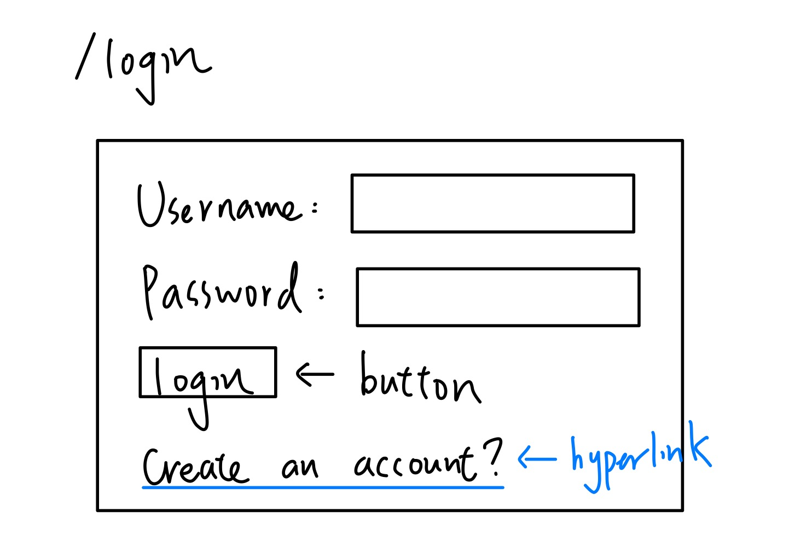
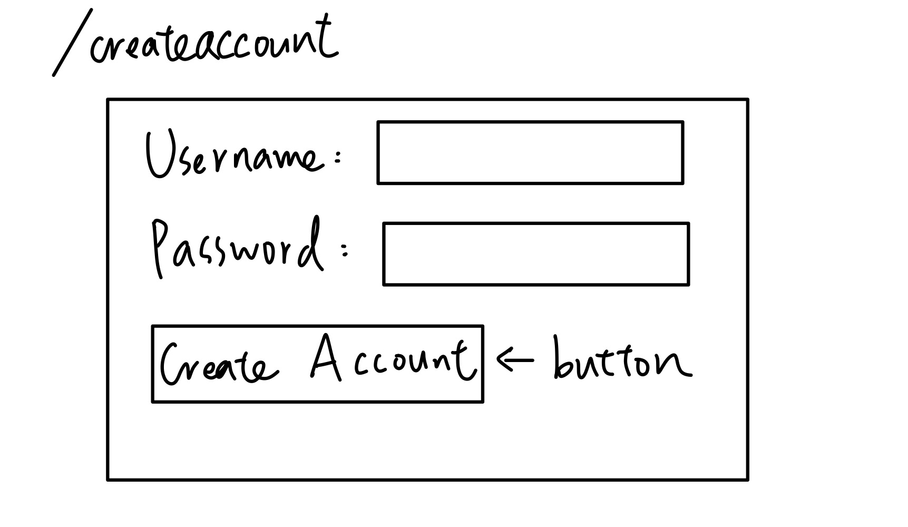
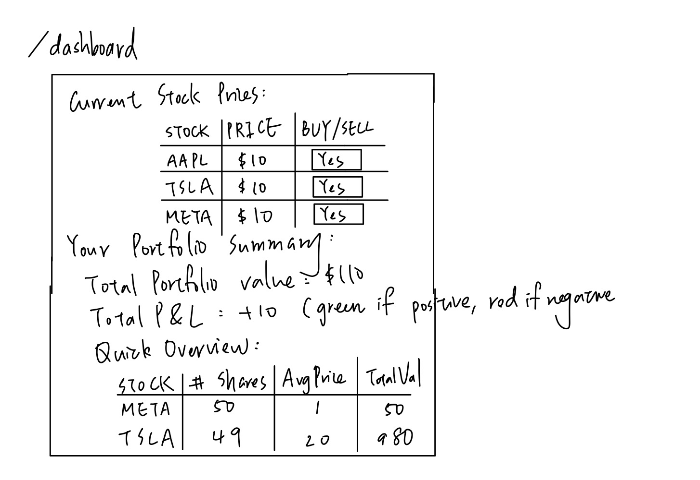
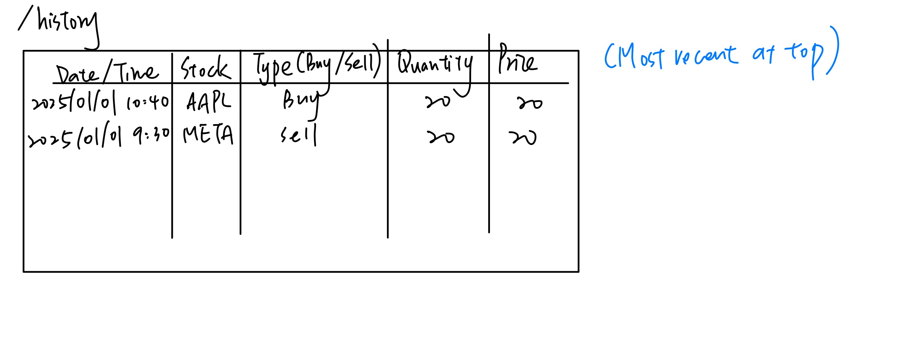
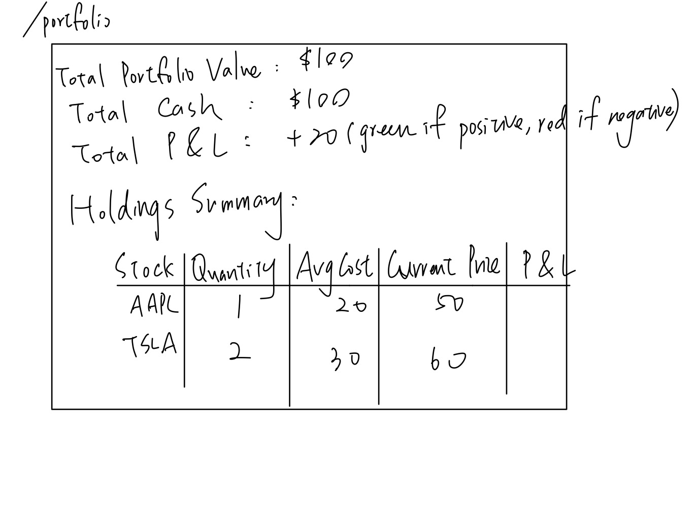
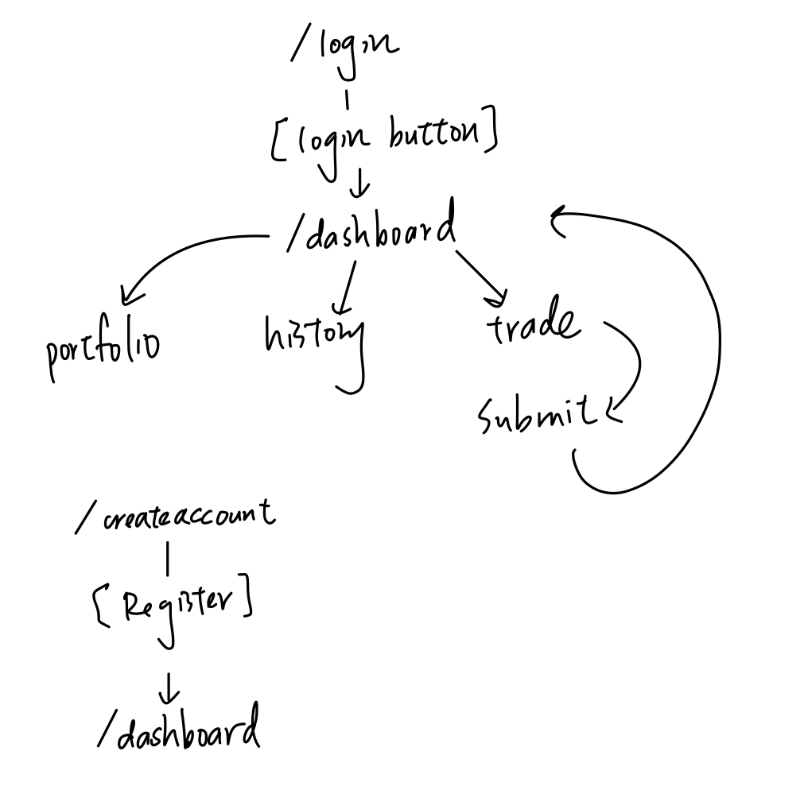

The content below is an example project proposal / requirements document. Replace the text below the lines marked "__TODO__" with details specific to your project. Remove the "TODO" lines.


# Stock Trading App (Name: IAL Trading) 

## Overview


As I have recently gotten into personal trading and am considering breaking into the quant industry in the future, I found it pretty interesting to build a trading app that mimics the real-time trading people do everyday. I believe there's a huge volume of trading and equities activity happening every day, both during market hours and post-market, so developing a good app that can handle an enormous number of requests and data retrieval is important. But since building a real industry-level large-scale app would require months of work, in this app I plan to select a few stocks in the market and allow clients/users to trade them. Here are the stocks I'm thinking of: AAPL, TSLA, NVDA, MSFT, GOOGL, AMZN, META. These stocks have good data availability and high trading volume. 

Users will trade independently in this app, and trades can be placed anytime, even during post-market hours. When users try to place an order, the app will check whether they have sufficient funds in their account. Stocks can be traded fractionally, so users aren't limited to whole shares. The real-time stocks' prices will be retrieved from Yahoo Finance API.

Features to be developed: 
- View 15-min delayed stock prices (live data is expensive)
- View available funds (users start with $100)
- Place buy/sell orders 
- View portfolio (current holdings and their values)
- Transaction history (showing P&L for each trade)


## Data Model


The application will store Users, Stocks and Transactions

* Users can have multiple transactions (one user has many transactions)
* Users can have multiple portfolio holdings (one user has many holdings)
* Transactions reference both users and stock symbols


An Example User:

```javascript
{
  username: "trader123",
  password: "hashed_password_here", // hashed 
  cashBalance: 850.50,
}
```

An Example Portfolio/Holdings entry:

```javascript
{
  user: // reference to User (ObjectId)
  stockSymbol: "AAPL",
  quantity: 2.5, // fractional shares allowed
  averageCostBasis: 180.00, // average price paid per share (for P&L calculation)
}
```

An Example Transaction:
```javascript
{
  user: // reference to User (ObjectId)
  stockSymbol: "AAPL",
  transactionType: "buy", // or "sell"
  quantity: 1.5,
  pricePerShare: 175.50,
  totalAmount: 263.25,
  timestamp: // timestamp
}
```


## [Link to Commented First Draft Schema](db.mjs) 

DONE! 


## Wireframes


/login - login page



/createaccount - page to create an account if haven't had one



/dashboard - page to view the dashboard



/history - page to view all the transaction history



/portfolio - page to view the portfolio



/trade - page to make a trade


## Site map

### Site Map:  



## User Stories or Use Cases


1. as a non-registered user, I can register a new account with the site
2. as a user, I can log in to the site
3. as a user, I can log out of the site
4. as a user, I can view the dashboard and view current stock prices 
5. as a user, I can view my available cash balance
6. as a user, I can place a buy order for a stock with a specified quantity (including fractional shares)
7. as a user, I can place a sell order for stocks I own with a specified quantity
8. as a user, I can view my portfolio showing all stocks I own with current values and P&L
9. as a user, I can view my transaction history showing all past trades with dates and prices

## Research Topics

* (5 points) User Authentication with Passport.js
  - Using passport-local strategy for username/password auth
  - Implementing session management with express-session
  - Protected routes that require authentication
  - Password hashing with bcrypt


* (6 points) React
    * Using React as the frontend framework to build an interactive trading interface
    * Will handle real-time portfolio updates and dynamic stock price displays
    * Integrating with Express backend for API calls
    * React will be covered in class, but implementing it as a full frontend framework with backend integration is substantial work

* (3 points) Unit Testing with Jest
    * Writing unit tests for core trading logic and functionality
    * Will test order validation (sufficient funds, valid quantities)
    * Will test P&L calculation logic
    * Will test portfolio update operations
    * Minimum 4 tests required
    * Will link to test code in repository and provide screenshots of test results

* (2 points) External API - yahoo-finance2 for Stock Data
    * Using yahoo-finance2 npm package to fetch real-time stock quotes
    * Will retrieve current prices for selected stocks (AAPL, TSLA, META, etc.)
    * Handle API errors and implement fallback behavior
    * Parse and display stock data on dashboard and trade pages

**Total: 10-11 points (depending on final choice)**


## [Link to Initial Main Project File](app.mjs) 


DONE! 


## Annotations / References Used


1. [React Official Documentation](https://react.dev/) - for building the frontend interface and components
2. [Jest Testing Documentation](https://jestjs.io/docs/getting-started) - for unit testing setup and writing tests
3. [yahoo-finance2 npm package](https://www.npmjs.com/package/yahoo-finance2) - for fetching real-time stock price data
4. [Mongoose Documentation](https://mongoosejs.com/docs/guide.html) - for schema design and database operations
5. [Express.js Documentation](https://expressjs.com/) - for server-side routing and API endpoints